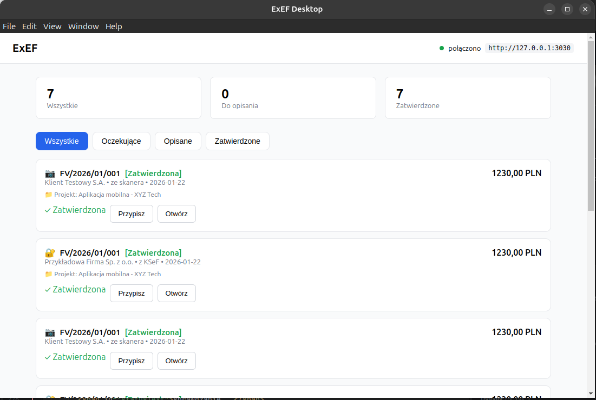
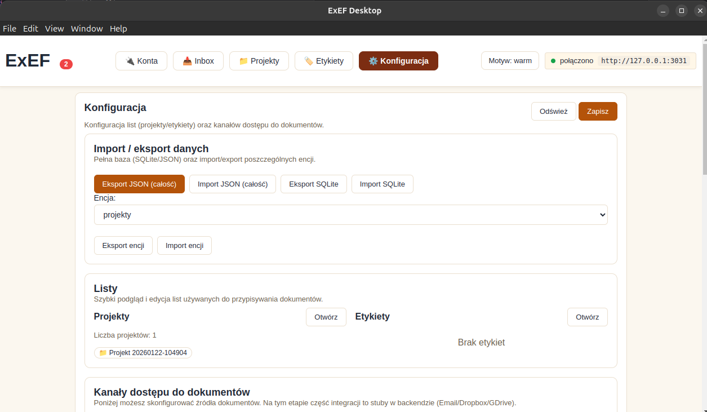

1 szkic


2 szkic



# exef-pl/app

To repozytorium jest agregatorem projektów związanych z KSeF (Krajowy System e-Faktur):

- trzymamy listę referencyjnych implementacji w `REPO.md` i pobieramy je jako submoduły Git,
- generujemy zunifikowane indeksy (Toon) dla każdego projektu, żeby dało się je porównywać i analizować,
- na bazie tych indeksów budujemy nowy projekt `exef/` (JavaScript + Docker), który docelowo generuje 3 artefakty:
  - web service (Docker) pod VPS/produkcję,
  - local service (binarka) dla Linux/Windows,
  - desktop app (binarka) dla Linux/Windows.

## Licencja

Ten projekt jest na licencji Apache-2.0 (`LICENSE`).

## Submoduły (repozytoria źródłowe)

Lista repo jest w `REPO.md`.

- Pobranie / inicjalizacja submodułów:

  ```bash
  make submodules
  ```

- Aktualizacja submodułów do najnowszych commitów:

  ```bash
  make update-submodules
  ```

## Indeksy (code2logic / pyhrton)

Indeksy generujemy narzędziem `code2logic` (z paczki `pyhrton`) w formacie Toon.

Wymaganie: komenda `code2logic` musi być dostępna w `PATH`.

Generowanie indeksów dla każdego submodułu (oddzielnie), z outputem do katalogu głównego `./`:

```bash
make indexes
```

Efekt:

- `./<project>.functions.toon`
- `./<project>.toon-schema.json`

Dodatkowo:

```bash
make analyze-all
```

tworzy raport `analysis_report.md` na podstawie wygenerowanych indeksów.

## Nowy projekt: `exef/` (Docker + JavaScript)

Katalog `exef/` zawiera projekt, który generuje 3 artefakty:
- web service (Docker) pod VPS/produkcję,
- local service (binarka) dla Linux/Windows,
- desktop app (binarka) dla Linux/Windows.

### Konfiguracja (`.env`)

Wszystkie artefakty czytają zmienne z pliku `.env` (lub wskazanego przez `EXEF_ENV_FILE`). Przykładowy plik to `.env.example`.

Ważne zmienne:
- `KSEF_ENV` (`test|demo|production`) i `KSEF_BASE_URL`
- `EXEF_WEB_HOST`, `EXEF_WEB_INTERNAL_PORT`, `EXEF_WEB_PORT_MAPPING` (docker)
- `EXEF_LOCAL_SERVICE_HOST`, `EXEF_LOCAL_SERVICE_PORT`, `EXEF_LOCAL_SERVICE_PORT_FILE`
- `EXEF_DESKTOP_LOCAL_SERVICE_BASE_URL` (opcjonalny override)

Backend storage (pliki vs SQLite):
- `EXEF_STORAGE_BACKEND` (`files` lub `sqlite`)
- `EXEF_DB_PATH` (ścieżka do pliku SQLite; używane gdy `EXEF_STORAGE_BACKEND=sqlite`)

Automatyczna zmiana portu przy konflikcie:
- **local-service**: jeśli preferowany port zajęty, wybiera kolejny wolny (lub losowy) i zapisuje go do `EXEF_LOCAL_SERVICE_PORT_FILE`.
- **desktop**: czyta faktyczny port z `EXEF_LOCAL_SERVICE_PORT_FILE`, więc działa nawet przy konflikcie.
- **web**: w Dockerze używa `make exef-web-up` do dobrania wolnego host-portu.

### 1) Web service (Docker / VPS)

Budowanie i uruchomienie z auto-portem:

```bash
make exef-web-up
```

Ręcznie przez Docker Compose:

```bash
docker compose -f exef/docker-compose.yml up --build
```

- Domyślnie: `http://localhost:3000/health`

### 2) Local service (binarka: Linux/Windows)

Uruchomienie developerskie:

```bash
cd exef
npm install
npm run local
```

Build binarki (pkg):

```bash
cd exef
npm run build:local:bin
```

Paczki Linux (deb/rpm) przez nfpm:

```bash
make exef-local-packages
```

### 3) Desktop app (binarka: Linux/Windows)

Uruchomienie developerskie:

```bash
cd exef
npm install
npm run desktop
```

Build instalatorów/paczek (electron-builder):

```bash
cd exef
npm run build:desktop
# lub z głównego katalogu:
make exef-desktop-build
cd exef && npm run desktop
```

Smoke-test na Linux (start local-service, weryfikacja health, uruchomienie AppImage):

```bash
make exef-desktop-test
```

### 4) Wszystkie artefakty naraz

```bash
make exef-all
```

## Architektura Obiegu Faktur

EXEF obsługuje faktury z wielu źródeł jednocześnie:

- **Email** - załączniki PDF/JPG (IMAP/OAuth)
- **Skaner** - dokumenty papierowe
- **Storage** - pliki z Dropbox/Google Drive/lokalnie
- **KSeF** - e-faktury w formacie XML

### Moduły

| Moduł | Plik | Opis |
|-------|------|------|
| Unified Inbox | `src/core/unifiedInbox.js` | Centralna kolejka faktur |
| Email Watcher | `src/core/emailWatcher.js` | Monitoring IMAP/OAuth |
| Storage Sync | `src/core/storageSync.js` | Sync z chmurą/lokalnie |
| OCR Pipeline | `src/core/ocrPipeline.js` | Przetwarzanie PDF/JPG |
| Auto-Describe | `src/core/autoDescribe.js` | Automatyczne opisy |
| Draft Store | `src/core/draftStore.js` | Przechowywanie faktur |
| Export Service | `src/core/exportService.js` | Eksport CSV/wFirma |
| Invoice Workflow | `src/core/invoiceWorkflow.js` | Orkiestrator całości |

### Statusy faktury

```
pending → ocr → described → approved → booked
                    ↓
                rejected
```

### API Endpoints (Inbox)

| Endpoint | Metoda | Opis |
|----------|--------|------|
| `/inbox/stats` | GET | Statystyki faktur |
| `/inbox/invoices` | GET | Lista faktur (filtrowanie: `?status=`, `?source=`) |
| `/inbox/invoices/:id` | GET | Szczegóły faktury |
| `/inbox/invoices` | POST | Dodaj fakturę ręcznie |
| `/inbox/invoices/:id/process` | POST | Przetwórz (OCR + auto-opis) |
| `/inbox/invoices/:id/approve` | POST | Zatwierdź |
| `/inbox/invoices/:id/reject` | POST | Odrzuć |
| `/inbox/export` | POST | Eksportuj zatwierdzone (CSV/JSON/wFirma) |
| `/inbox/ksef/poll` | POST | Pobierz nowe faktury z KSeF |

### API Endpoints (Dane / baza)

Poniższe endpointy działają dla `EXEF_STORAGE_BACKEND=sqlite`:

| Endpoint | Metoda | Opis |
|----------|--------|------|
| `/data/export` | GET | Eksport całej bazy jako JSON bundle |
| `/data/import` | POST | Import całej bazy z JSON bundle |
| `/data/export/:entity` | GET | Eksport encji: `projects`, `labels`, `expense-types`, `invoices`, `contractors`, `settings` |
| `/data/import/:entity` | POST | Import encji (format jak w eksporcie) |
| `/db/export.sqlite` | GET | Eksport pliku SQLite |
| `/db/import.sqlite` | POST | Import pliku SQLite (payload `{ base64 }`) |
| `/contractors` | GET | Lista kontrahentów (wyciąganych z faktur) |

### API Endpoints (UI)

| Endpoint | Metoda | Opis |
|----------|--------|------|
| `/ui/theme` | GET | Pobierz motyw UI |
| `/ui/theme` | PUT | Ustaw motyw UI (`white`, `dark`, `warm`) |
| `/ui/contrast/report` | POST | Raport kontrastu (WCAG) dla podanej palety |

### Konfiguracja (`.env`)

```bash
EXEF_INVOICE_STORE_PATH=./data/invoices.json
EXEF_WATCH_PATHS=/home/user/Faktury,/home/user/Do-opisania
```

### Moduły pomocnicze

| Moduł | Plik | Opis |
|-------|------|------|
| Invoice Builder | `src/core/invoiceBuilder.js` | Fluent builder dla faktur (EntityBuilder, InvoiceLineBuilder, InvoiceBuilder) |
| Validators | `src/core/validators.js` | Walidacja NIP, IBAN, kwot, dat + formatowanie PLN |

Przykład użycia buildera:

```javascript
const { EntityBuilder, InvoiceBuilder, InvoiceLineBuilder, VAT_RATES } = require('./src/core/invoiceBuilder')

const seller = EntityBuilder.create()
  .withName('Firma Sp. z o.o.')
  .withNip('1234567890')
  .withAddress('ul. Testowa', '1', 'Warszawa', '00-001')
  .build()

const invoice = InvoiceBuilder.vatInvoice('FV/2026/01/001', '2026-01-22', seller, buyer)
  .addLine(InvoiceLineBuilder.simple('Usługa', 1, 1000, VAT_RATES.VAT_23))
  .calculateTotals()
  .build()
```

## Testowanie

### Testy API (make exef-test-api)

```bash
# Uruchom local-service w tle
make exef-local-dev &

# Uruchom testy API
make exef-test-api
```

Testy używają przykładowych faktur z `exef/test/fixtures/`:
- `sample-invoice.json` - faktura w formacie JSON
- `sample-invoice.xml` - faktura KSeF XML (FA3)

### Testy GUI (make exef-test-gui)

Interaktywny interfejs do testowania API w przeglądarce:

```bash
# Uruchom local-service i otwórz przeglądarkę
make exef-test-gui

# Lub ręcznie:
make exef-local-dev &
# Otwórz: http://127.0.0.1:<PORT>/test/
# (PORT jest wybierany automatycznie i zapisywany w exef/.exef-local-service.port)
```

**Funkcje GUI:**
- Testowanie wszystkich endpointów API
- Formularze z parametrami dla każdego testu
- Podgląd odpowiedzi JSON
- Uruchamianie wszystkich testów jednym kliknięciem
- Log wyników testów

**Uwagi dot. portów:**
- Strona `/test/` domyślnie używa `window.location.origin` jako API.
- Jeśli local-service wybierze inny port (fallback), otwieraj `/test/` z tego samego portu.
- URL API można zmienić klikając na adres w prawym górnym rogu.

## CLI (Command Line Interface)

ExEF udostępnia CLI do zarządzania fakturami z poziomu terminala.

### Instalacja

```bash
# Z npm (globalnie)
cd exef && npm link

# Lub bezpośrednio
node exef/bin/exef.cjs <komenda>

# Lub przez make
make exef-cli ARGS="inbox list"
```

### Podstawowe komendy

```bash
# Sprawdź status usługi
exef health

# Lista faktur
exef inbox list
exef inbox list --status pending
exef inbox list --source ksef --json

# Statystyki
exef inbox stats

# Dodaj fakturę
exef inbox add --file faktura.pdf --source scanner
exef inbox add --file faktura.xml --source ksef

# Przetwórz i zatwierdź
exef inbox process <id>
exef inbox approve <id> --category hosting --mpk IT-001

# Eksport
exef inbox export --format csv --output faktury.csv

# KSeF
exef ksef auth --token <token> --nip <nip>
exef ksef poll --since 2026-01-01

# Dane / baza (SQLite)
exef data export --output exef-data.json
exef data import --file exef-data.json
exef data export-entity projects --output projects.json
exef db export --output exef.sqlite

# UI
exef ui theme get
exef ui theme set --theme dark
```

### Mapowanie CLI ↔ REST API

| CLI | REST API |
|-----|----------|
| `exef inbox list` | `GET /inbox/invoices` |
| `exef inbox stats` | `GET /inbox/stats` |
| `exef inbox add` | `POST /inbox/invoices` |
| `exef inbox process <id>` | `POST /inbox/invoices/:id/process` |
| `exef inbox approve <id>` | `POST /inbox/invoices/:id/approve` |
| `exef inbox export` | `POST /inbox/export` |
| `exef ksef poll` | `POST /inbox/ksef/poll` |

Pełna dokumentacja CLI: [`exef/docs/CLI.md`](exef/docs/CLI.md)

### Dostępne komendy Makefile

**Development:**
- `make exef-install` - instalacja zależności
- `make exef-dev` - uruchomienie web service (dev)
- `make exef-local-dev` - uruchomienie local service (dev)
- `make exef-cli ARGS="..."` - uruchomienie CLI
- `make exef-test` - testy jednostkowe
- `make exef-test-api` - testy integracyjne API
- `make exef-test-gui` - testy GUI w przeglądarce
- `make exef-lint` - linter
- `make exef-clean` - czyszczenie artefaktów

**Build:**
- `make exef-web-docker` - Docker image dla web
- `make exef-web-up` - uruchomienie Docker Compose
- `make exef-local-build` - binarka local-service
- `make exef-local-packages` - paczki deb/rpm
- `make exef-desktop-build` - AppImage/instalatory
- `make exef-desktop-test` - smoke test desktop
- `make exef-cli-build` - binarka CLI standalone
- `make exef-cli-install` - instalacja CLI globalnie
- `make exef-all` - wszystkie artefakty

## Release / tagowanie (make push)

W tym repo tagowanie i wersjonowanie jest zautomatyzowane.

Zasada:

- robisz zmiany i commitujesz,
- uruchamiasz `make push`.

`make push`:

- podbija wersję (plik `VERSION`),
- generuje wpisy release w `docs/v/<tag>/`:
  - `docs/v/<tag>/changelog.md`
  - `docs/v/<tag>/todo.md`
- tworzy commit release,
- tworzy tag `vX.Y.Z`,
- wykonuje `git push --follow-tags`.

Typ bumpu możesz ustawić przez `BUMP`:

```bash
BUMP=patch make push
BUMP=minor make push
BUMP=major make push
```

## Testowanie

Szczegóły są w `docs/TESTING.md`.

## 🤝 Kontrybucja

Zasady kontrybucji są w `docs/CONTRIBUTING.md`.

