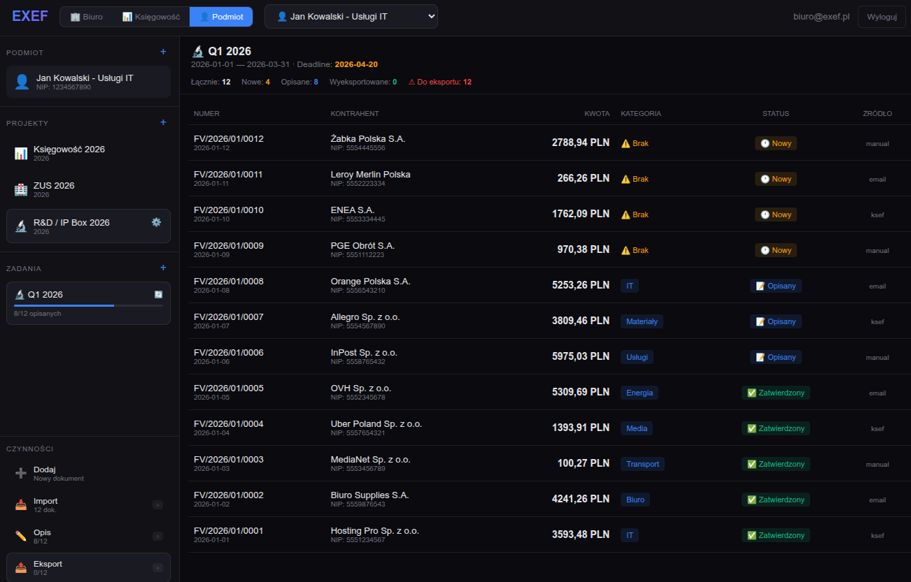
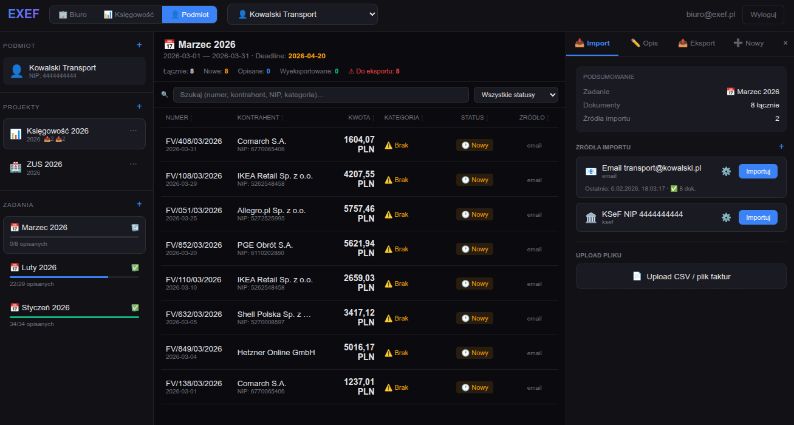

# EXEF - Document Flow Engine

System zarządzania dokumentami księgowymi dla polskich firm.

## 🏗️ Architektura

```
┌────────────────────────────────────────────────────────────────┐
│                         EXEF                                   │
├────────────────────────────────────────────────────────────────┤
│                                                                │
│  TOŻSAMOŚĆ (Identity)                                         │
│  └── Użytkownik z NIP/PESEL, autentykacja JWT                │
│                                                                │
│  PODMIOT (Entity)                                             │
│  └── JDG | Małżeństwo | Spółka | Organizacja                 │
│  └── Własna baza danych, członkowie z rolami                  │
│                                                                │
│  PROJEKT (Project)                                            │
│  └── Księgowość | JPK | ZUS | VAT-UE | R&D                   │
│  └── Autoryzacja dla innych tożsamości                        │
│                                                                │
│  ZADANIE (Task)                                               │
│  └── Jednostka pracy z ramami czasowymi                       │
│                                                                │
│  DOKUMENT (Document)                                          │
│  └── Faktury, umowy z metadanymi                             │
│                                                                │
└────────────────────────────────────────────────────────────────┘
```

## 🧪 Logowanie testowe

Aplikacja wspiera logowanie przez **magic link** (link bezhasłowy).

### Testowe dane logowania

| Email | Hasło |
|-------|-------|
| `test@example.com` | `Test123` |
| `test2@example.com` | `Test123` |

### Pobieranie magic linku

Po poproszeniu o link logowania, email z magic linkiem trafia do lokalnego serwera testowego.

**Opcja 1 - Interaktywny klient email:**

```bash
make email-client
```

Komendy w kliencie:
- `l` - lista wszystkich emaili
- `n` - pokaż najnowszy email
- `o` - otwórz magic link z najnowszego emaila w przeglądarce
- `c` - pokaż najnowszy kod jednorazowy z bazy danych
- `q` - wyjście
- `h` - pomoc

**Opcja 2 - CLI (jednorazowe polecenie):**

```bash
# Pokaż najnowszy email
python3 test_email_client.py --latest

# Otwórz magic link w przeglądarce
python3 test_email_client.py --open-latest

# Lista wszystkich emaili
python3 test_email_client.py --list

# Pokaż najnowszy kod jednorazowy z bazy danych
python3 test_email_client.py --code
```

**Opcja 3 - Bezpośrednio z plików:**

Emaile są zapisywane jako pliki JSON w katalogu `./test_emails/`. Magic link znajduje się w polu `magic_link` lub można go wyciągnąć z treści emaila.

```bash
# Zobacz wszystkie zapisane emaile
ls -la ./test_emails/

# Przykład wyciągnięcia magic linku
cat ./test_emails/*.json | grep "magic_link"
```

**Opcja 4 - Bezpośrednio z bazy danych:**

Jeśli serwer SMTP nie działa, możesz uzyskać kod jednorazowy bezpośrednio z bazy danych:

```bash
# Pokaż najnowszy kod jednorazowy
python3 test_email_client.py --code

# Lub bezpośrednio z bazy danych
sqlite3 data/exef.db "SELECT one_time_code FROM magic_links WHERE is_used = 0 ORDER BY created_at DESC LIMIT 1;"
```

## 🚀 Uruchomienie

### Docker (zalecane)

```bash
# Sklonuj lub rozpakuj projekt
cd exef

# Uruchom
docker-compose up --build

# Aplikacja dostępna:
# - Frontend: http://localhost:3000
# - Backend API: http://localhost:8000
# - API Docs: http://localhost:8000/docs
```

### Ręcznie

#### Backend (Python/FastAPI)

```bash
cd backend

# Utwórz virtualenv
python -m venv venv
source venv/bin/activate  # Linux/Mac
# lub: venv\Scripts\activate  # Windows

# Zainstaluj zależności
pip install -r requirements.txt

# Uruchom
uvicorn app.main:app --reload --port 8000
```

#### Frontend (React/Vite)

```bash
cd frontend

# Zainstaluj zależności
npm install

# Uruchom
npm run dev
```

## 📚 API Endpoints

### Autentykacja
- `POST /api/v1/auth/register` - Rejestracja
- `POST /api/v1/auth/login` - Logowanie (zwraca JWT)
- `GET /api/v1/auth/me` - Dane zalogowanego użytkownika

### Podmioty (Entities)
- `GET /api/v1/entities` - Lista podmiotów
- `POST /api/v1/entities` - Utwórz podmiot
- `GET /api/v1/entities/{id}` - Szczegóły podmiotu
- `POST /api/v1/entities/{id}/members` - Dodaj członka

### Projekty
- `GET /api/v1/projects` - Lista projektów
- `POST /api/v1/projects` - Utwórz projekt
- `GET /api/v1/projects/{id}` - Szczegóły projektu
- `POST /api/v1/projects/{id}/authorizations` - Autoryzacja dla innej tożsamości

### Zadania
- `GET /api/v1/projects/{id}/tasks` - Lista zadań w projekcie
- `POST /api/v1/tasks` - Utwórz zadanie
- `PATCH /api/v1/tasks/{id}` - Aktualizuj zadanie

### Dokumenty
- `GET /api/v1/tasks/{id}/documents` - Lista dokumentów w zadaniu
- `POST /api/v1/documents` - Utwórz dokument
- `PATCH /api/v1/documents/{id}/metadata` - Aktualizuj metadane
- `POST /api/v1/documents/{id}/approve` - Zatwierdź dokument

## 🔐 Autoryzacja

System używa JWT tokenów. Po zalogowaniu token należy dołączać do każdego żądania:

```
Authorization: Bearer <token>
```

### Role w podmiocie
- **OWNER** - Właściciel, pełny dostęp
- **ACCOUNTANT** - Księgowy, dostęp do projektów i dokumentów
- **ASSISTANT** - Asystent, może opisywać dokumenty
- **VIEWER** - Podgląd

### Autoryzacja do projektów innych podmiotów
Właściciel projektu może nadać autoryzację innej tożsamości z określonym zakresem uprawnień.

## 📁 Struktura projektu

```
exef/
├── backend/
│   ├── app/
│   │   ├── api/          # Endpointy API
│   │   ├── core/         # Konfiguracja, security
│   │   ├── models/       # Modele SQLAlchemy
│   │   ├── schemas/      # Schematy Pydantic
│   │   └── main.py       # Główna aplikacja FastAPI
│   ├── Dockerfile
│   └── requirements.txt
│
├── frontend/
│   ├── src/
│   │   ├── App.jsx       # Główny komponent
│   │   └── main.jsx
│   ├── Dockerfile
│   └── package.json
│
├── docker-compose.yml
└── README.md
```

## 🛠️ Technologie

- **Backend**: Python 3.11, FastAPI, SQLAlchemy, SQLite
- **Frontend**: React 18, Vite
- **Auth**: JWT (python-jose), bcrypt
- **Docker**: docker-compose

## 📝 Licencja

